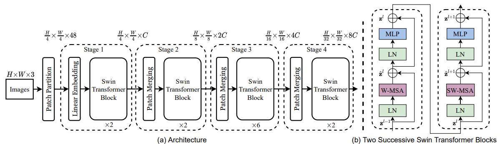
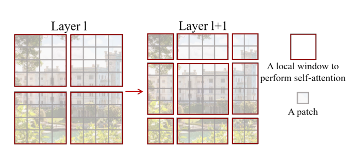
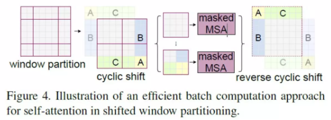
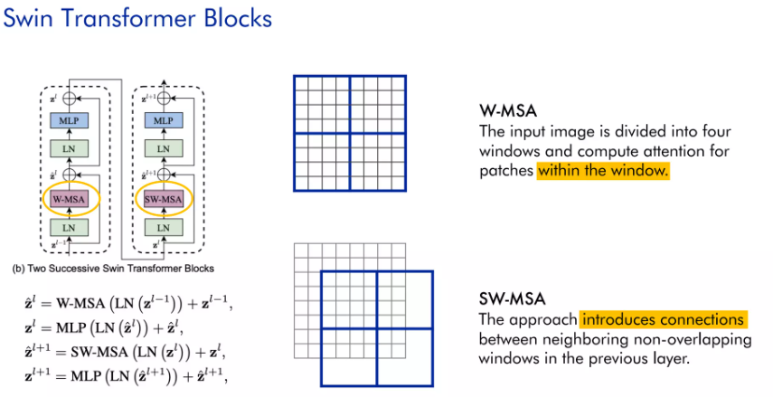

# Swin Transformer 
*Knowledge provided by* [AI VIET NAM](https://aivietnam.edu.vn/) 

Reimplementation of Swin Transfoermer model *based on* [The official implementation for Swin Transformer](https://github.com/microsoft/Swin-Transformer)



The script `train.py` performs model training

___________
## Installing dependencies
```
> git clone https://github.com/mminh007/swin-transformer.git
> cd swin-transformer
```
_________
## Config
the *config.yaml* file is located *./configs* 

example: ./configs/tiny_patch4_window7_224_cifar10.yaml
_________
## Run script
```
python ./train.py --config_file ./configs/tiny_patch4_window7_224_cifar10.yaml
```
________
# NOTE
The model is set up with two configurations. 

Dataset: **CIFAR10**

```
tiny model:
    - image size: 224
    - embed_dim: 96
    - patch size: 4
    - num heads: [3, 6, 12, 24]
    - depths: [2, 2, 6, 2]
    - window_size: 7
```

```
base model:
    - image: 224
    - embed_dim: 96
    - patch size: 4
    - num heads: [4, 8, 16, 32]
    - depths: [2, 2, 18, 2]
    - window size: 7
```
_______________________________

## Window partition



### Motivation
Challenges in adapting Transformer from language to vision arise from differences between the two domains.

Regular self-attention requires quadratic of the image size number of operations, limiting applications in computer vision where high resolution is necessary.

### Shift window based Self-Attention
Self-attention is applied on each patch, here referred to as windows. In layer 1 (left), a regular window partitioning scheme is adopted, and self-attention is computed within each window.

Then, the windows are shifted, resulting in a new window configuration to apply self-attention again. This allows the creation of connections between windows while maintaining the computation efficiency of this windowed architecture.
_________________________________

## Cyclic-Shift
The paper propose an efficient batch computation approach by cylic-shift toward the top-left direction.

After this shift, a batched window may be composed of several sub-windows that are not adjacent in the feature map, so a masking mechanism is employed to limit self-attetion computation to within each sub-window.



_____________

## Swin Block


